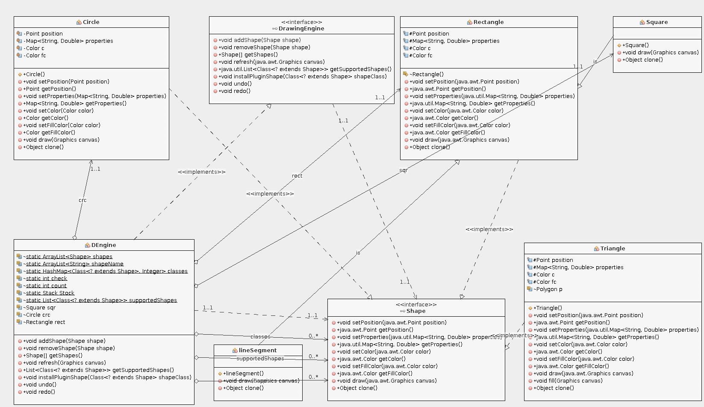
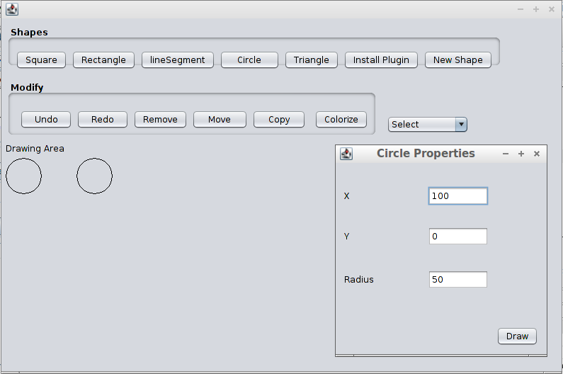
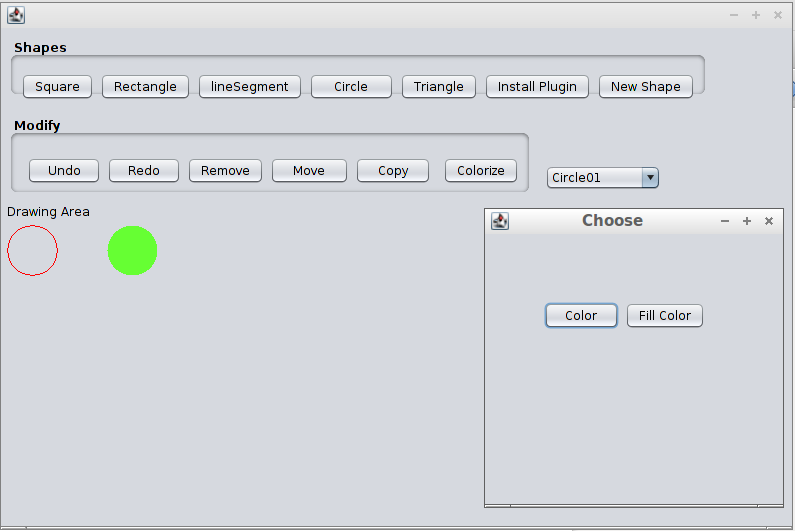
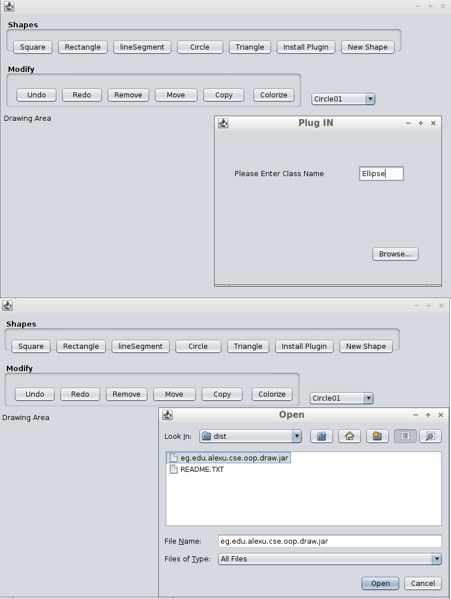
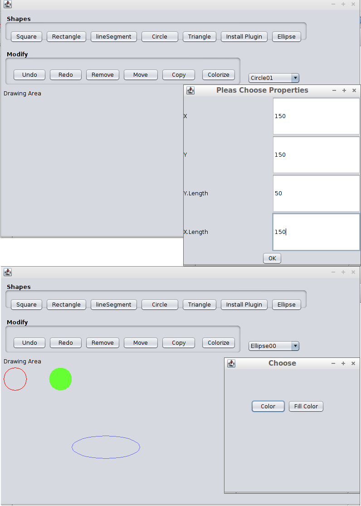
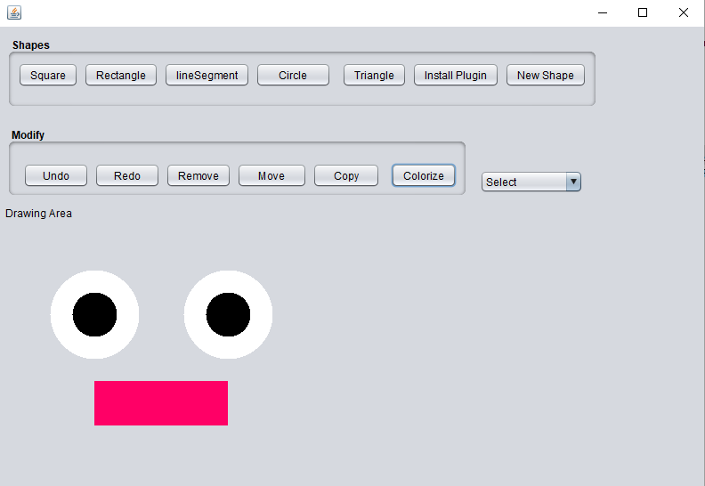

# PaintProgram
- Paint is a program designed to draw and paint obviously. It can draw many shapes like(Circle, Triangle, Square, Line Segment and Rectangle). But what’s special with the program is that it can install and load an external shape Plugin to support any external drawings needed.

- You can also modify the drawn shapes by choosing them from the drop down list such as moving, copying, coloring, filling or removing the shape. You can also undo or redo any recent changes.

**Features**

1- The program supports Undo and Redo features using stack to undo and changes.
2- You can Modify any drawn Shape from the drop down list easily.
3- You can add any new Shape from an external Plugin with only a jar file.
4- A very friendly User interface.

**UML Class Diagram**

**Sample Runs**

- Creating a shape

- Coloring a shape

- Installing an external plugin

- Creating an external plugin shape and coloring it

- Trying to be creative :D

